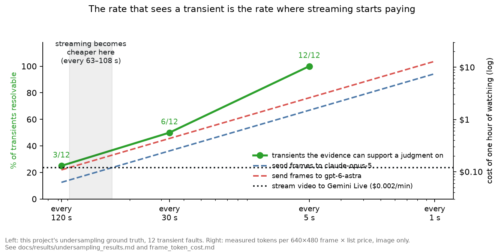

# LiveLab: Multimodal Lab Observer

A controlled benchmark for whether scientific agents can distinguish what is wrong, what the
current sensors actually support, and what remains unknowable during a physical experiment.

> A self-driving lab should not only choose the next experiment. It should recognize when the
> current experiment is going wrong, distinguish physical failure from scientific evidence, and
> know when the available sensors are insufficient to tell.

## The finding

**Asked to watch an experiment under this benchmark's contract, models almost never say they
cannot tell: 7 abstentions out of 2,134 judgments where nothing else was supported.**

| Where only `UNKNOWN` is supported | Judgments | Abstentions |
| --- | ---: | ---: |
| Simulated benchmark, Gemini 3.8 Live, three arms | 1,986 | **0** |
| The same wording, four models | 55 | **0** |
| A real plant, with the observing instruments removed, three models† | 93 | **7** |

† **Correction (2026-09-21):** the real-plant runs first gave the models a wrong description of
the plant's instruments: five heater temperatures were called column temperatures, and reflux and
distillate were swapped. A registered rerun with the description corrected gave **the same 0, 4
and 3 abstentions**. [Both runs side by side](docs/results/realdata_v2_results.md)

The sensor that would show it is not installed, or the excursion is shorter than the sampling
interval — and the answer is `NORMAL` or `ANOMALOUS` anyway. The models are not confused about what
they can see: asked as its own question, all four say *"atmosphere cannot be verified"* on exactly
the same 12 of 14 items, and then rule on all 12.

Three things sharpen it:

- **It is not a prompt problem, and not only a Gemini problem.** Under the benchmark's own wording
  every model abstains **0 of 55**. One added sentence defining when to answer `UNKNOWN` then moves
  Opus 5 to 13/14 and GPT-6 Astra to 14/14 — and Gemini by nothing, at any thinking level.
  [Cross-model results](docs/results/crossmodel_results.md)
- **It is not an artefact of the simulator, as far as tested.** Put to 119 runs of a real
  distillation plant with the plant's own expert annotations as truth, abstention was **0, 4 and 3
  of 31**, and exactly the same again after correcting the instrument description (noted above).
  [Real-plant results](docs/results/realdata_results.md)
- **It is not about missing sensors specifically.** Give the model a single unexplained reading and
  nothing to confirm it, and abstention is **0 of 6**, in both models tested.
  [Undersampling results](docs/results/undersampling_results.md)
- **A camera does not fix it.** With the plant's own camera added to the blind items, neither
  model said `UNKNOWN` more often. Gemini ignored the frames. Opus 5 called more runs anomalous
  with them: **+21 points** on blind items and **+38 points on fault-free runs**. Every changed
  verdict went towards `ANOMALOUS`. A registered follow-up found what the frames were doing, and it
  was not showing anything. Photographs of a *different* normal run produced almost the same
  shift. The sentence announcing a camera, with nothing attached, produced about half of it. Every
  false alert, in every arm, rests on one telemetry reading that the camera cue tips over the line.
  The camera runs described that channel wrongly (the correction above). But the real-plant rerun
  shows Opus alerts on it under the correct description too, so the camera is tipping a reading
  the model doubts either way. The camera studies themselves were not rerun.
  [Camera results](docs/results/vision_results.md) ·
  [follow-up](docs/results/vision_followup_results.md)


The figure is also why this benchmark carries control arms. On the real plant GPT-6 Astra detects
**30 of 31** anomalies, the best number here — and calls **all 37** fault-free runs anomalous too.
Reported without its control, that 97% would have ranked it first. It is not an artefact of the
instrument description: rerun with that description corrected, Astra detects 31 of 31 and still
calls 36 of 37 fault-free runs anomalous. It is alarmed by one heater running far hotter than the
vessel it heats, which the plant's experts treat as normal.

**Implication:** "cannot verify" has to be a system state, computed from which sensors are
installed and what each stage needs, or asked as its own question. It cannot be left to the
model's verdict — on Gemini because nothing else works, and elsewhere because a sentence in a
prompt is not a guarantee.

## How it was tested

Every study below was **registered before it ran**, and each registration's deviations — including
the predictions I lost — are in the same file.

| Study | What it asks | Registration | Result |
| --- | --- | --- | --- |
| Benchmark | Does context or imagery fix detection? Does confidence track observability? | [design](docs/design.md) | 38 replays × 3 arms, [6,728 events](docs/results/arm_comparison.md) |
| `UNKNOWN` probe | Is it knowledge, convention, or option bias? | [registered](docs/probe_preregistration.md) | none of the three — [findings](docs/results/probe_findings.md) |
| Cross-model | Is it this family, or frontier models? | [registered](docs/crossmodel_preregistration.md) | [both, differently](docs/results/crossmodel_results.md) |
| Undersampling | Is observability set by the model or the sampling rate? | [registered](docs/undersampling_preregistration.md) | [by the sampling rate](docs/results/undersampling_results.md) |
| Real plant | Does any of it survive real data? | [registered](docs/realdata_preregistration.md) | [yes, and it prices the simulator](docs/results/realdata_results.md) |
| Real plant, rerun | Does it survive correcting the instrument description? | [registered](docs/realdata_v2_preregistration.md) | [abstention identical; false alerts are the models', not the description's](docs/results/realdata_v2_results.md) |
| Camera | With an instrument group gone, does the plant's camera put it back? | [registered](docs/vision_preregistration.md) | [no: one model ignores it, one alarms at it](docs/results/vision_results.md) |
| Camera follow-up | Was it the photographs, or the sentence announcing them? | [registered](docs/vision_followup_preregistration.md) | [half the words, half any photograph; not what they show](docs/results/vision_followup_results.md) |

Detection and context effects, which the first study measures, are in
[arm comparison](docs/results/arm_comparison.md): reference curves take detection from **0.50 to
0.90** and false alerts from **0.83 to 0.00**, and curves alone do as well as curves plus
micrographs — in-run detection comes from context, not from images.

### Which half of the thesis this tests

The project began from two claims. It has tested the second in full, and the first only in a weaker, practical form.

| | Status |
| --- | --- |
| **Physical observability exceeds software observability**, so a lab agent needs eyes as well as telemetry | **Strong form not tested; weak form tested, and it failed.** No public dataset has faults that only a camera can see ([survey](docs/material_survey.md)), so the strong form is untested. The weak form asks whether a camera covers for a missing instrument. It was tested on 48 real-plant items, and the camera did not help: Gemini ignored it, and Opus 5 alarmed more on faulty and fault-free runs alike ([results](docs/results/vision_results.md)) |
| **An agent cannot tell "I can't see it" from "nothing is wrong"** | **Tested, and this is the result above.** It holds across two families, seven framings and 97 items |

The second is the first one's precondition: an agent that does not know it is blind will not be
fixed by giving it eyes — it will report with the same confidence, now about pixels too. That is
now measured: given the plant's camera, neither model abstained more, and one of them called runs
faulty more often, whether they were or not.

But the strong form of the first claim is the one the words "multimodal" and "live" promise, so
it is stated here as open rather than implied as done. What it needs is not code: it needs **faults that only a camera
can see, and real in-run imagery of them**, and the project's hard rule is that physical imagery
must be real, never generated. That is the blocker, and
[docs/design.md](docs/design.md) carries the design that would answer it.


Full tables: [arm comparison](docs/results/arm_comparison.md) ·
[probe results](docs/results/probe_results.md) · [probe findings](docs/results/probe_findings.md) ·
[mock scorecard](docs/results/mock_scorecard.md).

## What the benchmark asks

After every observation event the agent calls `report_assessment()` and answers four questions:

1. Did something go wrong? (`execution_state`: NORMAL / ANOMALOUS / UNKNOWN)
2. What kind of thing went wrong? (`attribution`, `specific_cause`)
3. Do I actually have enough evidence to know? (abstention, and `scientific_evidence`:
   SUPPORTING / NEGATIVE / INCONCLUSIVE / NOT_YET_AVAILABLE)
4. What should I do next? (`proposed_action`, which is recorded but never executed)

Execution and scientific evidence are kept separate. A run that executed normally and grew nothing
is a **negative result**, not a malfunction. A result from a run with anomalous execution is
**inconclusive**. It is not evidence about the recipe.

## How it works

| Stage | What it does | Where |
| --- | --- | --- |
| Episodes | Instrument simulator (a PID-controlled tube furnace, MFC, pressure, exhaust O₂) with five fault types: seal leak, exhaust blockage, thermocouple drift, stuck MFC, stale status. Each run ends with a real, license-checked micrograph from a published paper | `livelab/simulator.py`, `scenarios/` |
| Ground truth | Pre-registered rules decide what the delivered evidence supports at each event. **Same evidence, same answer:** truth never depends on hidden state | `livelab/observability.py`, `data/truth/` |
| Frozen replay | Every condition receives identical evidence at identical times, with an opaque id and no truth | `data/replays/`, `livelab/harness.py` |
| Scoring | Five primary metrics, plus operational metrics, validated first against mock observers (oracle, always-normal, always-unknown, prior-matcher and others) | `livelab/scoring.py`, `livelab/mock_models.py` |
| Model | Gemini 3.8 Live on the free tier (the Extended Thinking probes on the paid tier), one Live session per replay, and an append-only audit log of visible behavior only | `livelab/backends.py`, `results/` |

The benchmark has **18 CVD episodes**, which render to **38 replays** once sensor-removal
conditions are included. The arms are: **A** (telemetry only), **C-context** (+ normal-run
reference curves) and **C-full** (+ micrographs).


## What this project cannot show

- **Not real-time failure detection in a real lab.** It is multimodal failure assessment in
  simulated live lab episodes.
- **No recipe is shown to work.** The simulator models the instrument, never the material.
- **No safety claim.** An LLM is not a safety system; hard interlocks are.
- **Telemetry dynamics are author-constructed.** Fault *types* cite published incidents
  (DeepMind arXiv 2608.26701; Anthropic MHS), but the curve shapes are the author's.
- **The simulator flatters the models, and by how much is measured.** Its reference bands come
  from 100 normal runs of an identical process, which a real plant does not have. On the real
  plant, with the instruments described correctly, the same three models reach **0.32, 0.55 and
  1.00** detection against 0.90 here. They call a fault-free run anomalous **8%, 35% and 97%** of
  the time, against 0.00 in the full arm here
  ([rerun](docs/results/realdata_v2_results.md)). Read this page's detection and false-alert
  numbers as an upper bound. The abstention result is the one that carried across.
- **The camera results are one model's behaviour on one plant.** The follow-up that explains
  Opus 5's shift ran on Opus 5 only, with one camera view, six frames and one wording of the
  announcement. That the camera "adds alarm, not information" is measured for that setting, not
  claimed for cameras in general
  ([follow-up registration](docs/vision_followup_preregistration.md)).
- **Images are real; their pairing with a run is not.** See `data/images/manifest.csv` and
  `data/images/ATTRIBUTION.md`.
- **The micrograph labels are not verified, and nothing rests on them.** A model assigned each
  class from a 230 × 114 crop and its caption. They cannot be checked here: the author is not a
  materials scientist, and the captions state growth parameters rather than morphology. So instead
  of asserting them, the benchmark measures what they carry: dropping **every** image-derived
  judgment leaves detection, false alert and appropriate abstention identical to four decimals and
  moves nothing by more than **0.005**
  ([the check](docs/results/image_label_exposure.md), rerun with
  `scripts/check_image_label_exposure.py`). An expert review would let this project make claims
  from images; until then it makes none.
- **One model, one run per replay.** Different seeds gave near-identical outputs (57 of 58 events),
  so variance comes from episode variants. Other models are untested.
- **Scientific-evidence judgments from images are confounded.** The prompt never defined the
  target as a *monolayer*, and the micrographs include several TMDs. These judgments are therefore
  not claimed as results.
- **"Scenario-unseen", not open-set.** Pretraining may include these failures.
- **Nothing here needs a streaming API — and that is a statement about the cadence, not about
  streaming.** Evidence arrives every 120 simulated seconds and each event is answered with one
  function call, which is request/response. At that rate a Live session is not worth its cost: it
  bills the whole accumulated context every turn, so a replay runs to 0.4M cumulative prompt tokens
  against a 16k final context, and it has no prompt caching. **But 120 s is also the rate at which
  9 of 12 transient faults cannot be judged at all.** The cadence that sees them is the cadence
  where streaming starts paying — measured, in the same place:
  

## How the wording was frozen

This benchmark changed its prompt wording three times after seeing results. Each change is recorded
with its reason in [docs/design.md §3.1](docs/design.md), and every version's logs are kept in
`results/`:

- **v1 → v2:** defined the `scientific_evidence` values.
- **v2 → v3:** changed "unavailable" to "not installed".
- **v3 → v4:** stopped showing per-stage sensor requirements, which the model read as a protocol
  violation.

Wording has been **frozen at v4**. The `UNKNOWN` result held under every version.

What went wrong along the way, and what it taught (evaluation design, contract ambiguity,
pre-registration, porting the harness between models, cost structure):
[docs/lessons_learned.md](docs/lessons_learned.md).

## Running it

```bash
python3 -m venv .venv && ./.venv/bin/pip install numpy pyyaml pytest matplotlib pillow google-genai
./.venv/bin/python -m pytest -q                       # everything below works without an API key
./.venv/bin/python scripts/render_replays.py          # frozen replays + separate truth files
./.venv/bin/python scripts/score_mocks.py             # validates the metrics on mock observers
./.venv/bin/python scripts/compare_arms.py            # scores archived runs -> docs/results/
./.venv/bin/python scripts/plot_results.py            # figures -> docs/figures/
```

To run Gemini 3.8 Live, copy `.env.example` to `.env` and put your key there. `.env` is gitignored;
never paste the key anywhere else.

```bash
./.venv/bin/python scripts/run_benchmark.py --backend gemini --arm C-full --resume
./.venv/bin/python scripts/run_probes.py && ./.venv/bin/python scripts/score_probes.py
```

On the free tier, one replay takes about a minute and roughly 0.4M cumulative prompt tokens. The
Live API counts the whole accumulated context on every turn, so events are 120 s apart and sent as
compact JSON.

## Licensing

- **Code and documentation:** MIT (see `LICENSE`).
- **Images in `data/images/cvd/`:** panels cropped from CC BY 4.0 articles. Each image's source,
  figure, panel and licence are in `data/images/manifest.csv`, with per-source attribution in
  `data/images/ATTRIBUTION.md`. Reuse them under CC BY 4.0, citing the original papers.
- **Telemetry and episodes:** author-constructed simulation, covered by the MIT licence above, and
  not data from any real run.

## Status

**Done:**
- the benchmark design;
- 18 CVD episodes;
- the scorer and its mock validation;
- arms A, C-context and C-full, each under frozen prompt v4;
- the pre-registered UNKNOWN probe;
- the Extended Thinking comparison, stage 1 (B0, B1 and B2 on the 14 U items).

Collecting that last one took a night and produced nothing on the free tier, where this model's
function-call path fails silently for hours, and about twenty minutes once billing was enabled.
What the failure looked like, how it was caught, and what now stops a harness from scoring it as
the model declining to answer: [deviation 7](docs/probe_preregistration.md) and
[lessons_learned.md](docs/lessons_learned.md).

**Not yet built:**
- the liquid-handling control;
- arm B (specialist detectors);
- C-vision and C-shuffled-image;
- a cross-model comparison;
- the Active Live demo.
