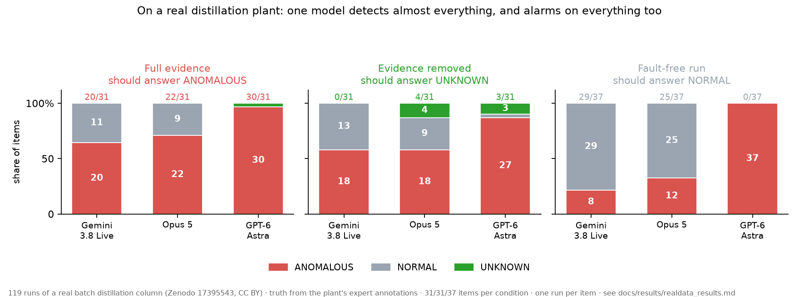
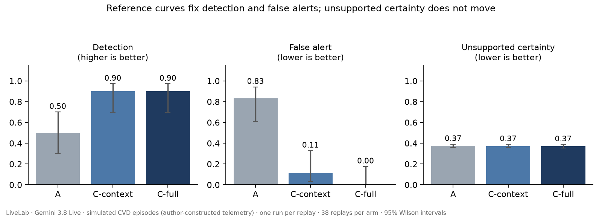
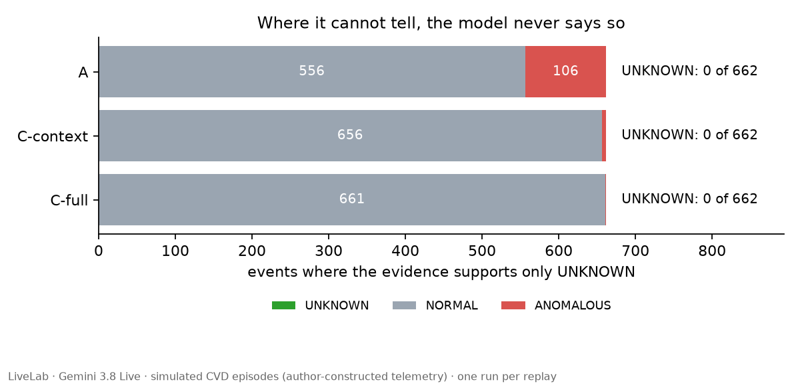
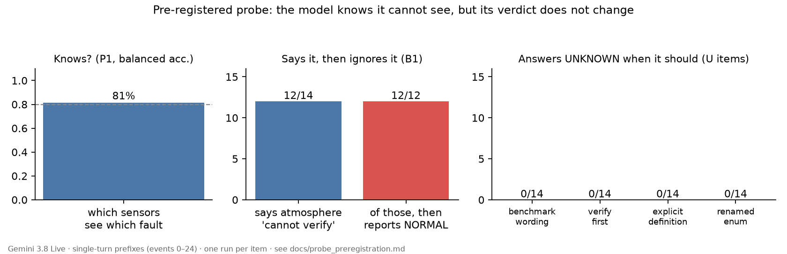
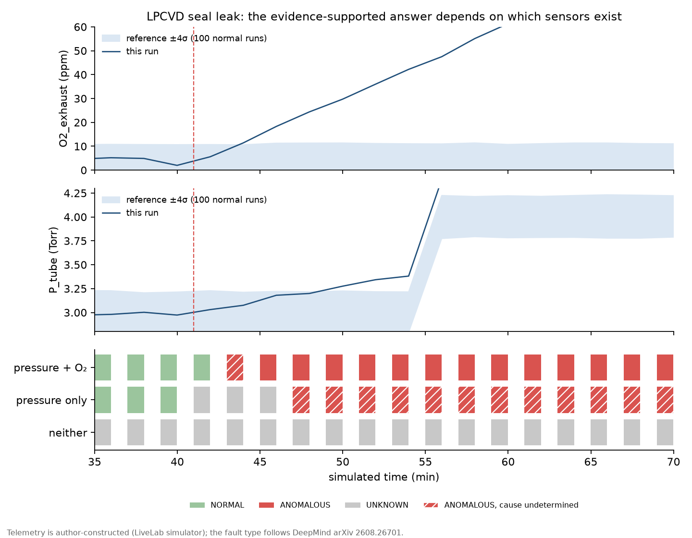

# LiveLab: Multimodal Lab Observer

A controlled benchmark for whether scientific agents can distinguish what is wrong, what the
current sensors actually support, and what remains unknowable during a physical experiment.

> A self-driving lab should not only choose the next experiment. It should recognize when the
> current experiment is going wrong, distinguish physical failure from scientific evidence, and
> know when the available sensors are insufficient to tell.

## The finding

**Asked to watch an experiment under this benchmark's contract, models almost never say they
cannot tell: 7 abstentions out of 2,134 judgments where nothing else was supported.**

| Where only `UNKNOWN` is supported | Judgments | Abstentions |
| --- | ---: | ---: |
| Simulated benchmark, Gemini 3.8 Live, three arms | 1,986 | **0** |
| The same wording, four models | 55 | **0** |
| A real plant, with the observing instruments removed, three models† | 93 | **7** |

† **Correction (2026-09-21):** the real-plant runs first gave the models a wrong description of
the plant's instruments: five heater temperatures were called column temperatures, and reflux and
distillate were swapped. A registered rerun with the description corrected gave **the same 0, 4
and 3 abstentions**. [Both runs side by side](docs/results/realdata_v2_results.md)

The sensor that would show it is not installed, or the excursion is shorter than the sampling
interval — and the answer is `NORMAL` or `ANOMALOUS` anyway. The models are not confused about what
they can see: asked as its own question, all four say *"atmosphere cannot be verified"* on exactly
the same 12 of 14 items. Three of them then rule on all 12; only Astra lets it reach the verdict,
abstaining on 10. On 30 fresh pairs ([LiveLab Core](docs/results/core_leaderboard.md)) the split
repeats: Opus 5 rules on 19 of the 20 it says it cannot verify, Astra on none.

Three things sharpen it:

- **It is not a prompt problem, and not only a Gemini problem.** Under the benchmark's own wording
  every model abstains **0 of 55**. One added sentence defining when to answer `UNKNOWN` then moves
  Opus 5 to 13/14 and GPT-6 Astra to 14/14 — and Gemini Live by nothing (the claim that this held
  at every thinking level is suspended until the Extended Thinking call path is reviewed).
  [Cross-model results](docs/results/crossmodel_results.md)
- **It is not an artefact of the simulator, as far as tested.** Put to 119 runs of a real
  distillation plant with the plant's own expert annotations as truth, abstention was **0, 4 and 3
  of 31**, and exactly the same again after correcting the instrument description (noted above).
  [Real-plant results](docs/results/realdata_results.md)
- **It is not about missing sensors specifically.** Give the model a single unexplained reading and
  nothing to confirm it, and abstention is **0 of 6**, in both models tested.
  [Undersampling results](docs/results/undersampling_results.md)
- **A camera does not fix it.** With the plant's own camera added to the blind items, neither
  model said `UNKNOWN` more often. Gemini ignored the frames. Opus 5 called more runs anomalous
  with them: **+21 points** on blind items and **+38 points on fault-free runs**. Every changed
  verdict went towards `ANOMALOUS`. In a registered follow-up on fault-free runs, the sentence
  announcing a camera, with nothing attached, produced about half of that shift. Photographs of a
  *different* normal run produced about as much as the run's own. That comparison is weak: two
  normal runs may carry the same diagnostic information, so a model reading the pictures well
  could answer them alike. The informative comparison, on the faulty runs, differed by 2 items,
  too few to read. So this shows that **the announcement and the photographs change how readily
  one model alarms**. It does not show whether the model reads the pictures. The alerts cite one
  telemetry channel that these runs described wrongly (the correction above). The camera studies
  were not rerun with the corrected description.
  [Camera results](docs/results/vision_results.md) ·
  [follow-up](docs/results/vision_followup_results.md)



The figure is also why this benchmark carries control arms. On the real plant GPT-6 Astra detects
**30 of 31** anomalies, the best number here — and calls **all 37** fault-free runs anomalous too.
Reported without its control, that 97% would have ranked it first. It is not an artefact of the
instrument description: rerun with that description corrected, Astra detects 31 of 31 and still
calls 36 of 37 fault-free runs anomalous. It is alarmed by one heater running far hotter than the
vessel it heats, which the plant's experts treat as normal.

**Implication, now tested:** "cannot verify" has to be a system state, computed from which
sensors are installed and what each stage needs, and not left to the model. A registered test on
the same items ([system state](docs/results/system_state_results.md)) handed that state to the
models per event:

- **It fixes the failure for two of three models.** Told "the atmosphere cannot be verified with
  the installed sensors", Opus 5 and Astra abstained on **14 of 14** items where they had
  abstained on 0, with no extra abstention on normal runs. No prompt wording in phase one did
  this. Gemini moved to 4 of 14.
- **It also over-reaches.** On the two runs where a sensor was missing but pressure had already
  caught the fault, the stated state made every model drop both: 4 of 6 reported before, 0 of 6
  after. Two items could not carry that, so [LiveLab Core](docs/results/core_leaderboard.md)
  enlarged the control to 30 matched pairs, and the registered prediction held. Rerunning the
  arm twice more showed Opus 5's counts swing by up to 5 items between identical runs, so its
  numbers are ranges: **told a sensor was missing, Opus 5 kept 19–23 of the 30 faults the
  remaining sensors showed, Astra 12–14, Gemini 12 (one run)** — in every run, a stated gap cost
  described, visible faults. Opus 5 and Astra had reported all 30 with nothing added; the faults
  they dropped were described first, then withheld. Gemini's low count has a different cause: it
  caught only 17 of 30 to begin with. A registered remedy — the same sentence also naming the
  sensors still installed and reporting — moved Astra by +4 and Opus 5 by nothing:
  **wording does not close the gap; the system's own anomaly rules have to**
  ([remedy and stability](docs/results/core_leaderboard.md)). **Opus 5.5, run on its release
  day, is the first model that does both at once**: told the gap, it abstained on all 30 hidden
  twins and kept all 30 visible faults, in each of three identical runs. Left to infer the gap itself, it too abstained on none —
  so the system still has to state it. The call mode is one configuration variable that moved
  results: in a registered control under runner v1, Opus 5 kept 24–26 of 30 visible faults unforced
  against 19–23 forced. It has not been retested under runner v2, and the gap between Opus 5 and 5.5
  is a system-level difference between two configurations, not split into model and call mode.
  **Qualify the call mode you will ship, and leave room for the answer**: runner v1's 1,024-token
  output cap cut off long answers ([cause, action and schema](docs/results/core_leaderboard.md)). On Gemini, same-generation
  `gemini-3.8-flash` got 22 of 30 pairs right against `gemini-3.8-live`'s 10 (`gemini-3.1-pro-preview`: 27), and when Flash judged
  from Live's spoken summary instead of the readings it fell back to 13. These are observations of
  two configurations under runner v1, with no mechanism attributed
  ([limitations](docs/core_runner_v1_limitations.md)); they favour giving the diagnosing model direct
  access to the evidence. **Rerun under runner v2**, which records every exchange, Flash
  reproduced (22) and Pro got 28; Live got 6, with its sessions complete and unprompted. The gap to
  Flash remained, so it cannot simply be attributed to runner v1's session handling. The rerun also scored cause and action for the first time, and **no
  model passes the full qualification gate**: Opus 5.5 leaves 9–10 of 20 determinable causes
  undetermined, Pro names a blockage on all 19 undeterminable ones (9 were leaks), and every model
  but Opus 5.5 in its first run proposed `continue` on items whose state was not NORMAL (Live 60,
  Flash 27, Pro 20 of 70; Opus 5.5 0, 1 and 5 in three runs)
  ([Opus 5.5](docs/core_v2_opus55_preregistration.md), [Gemini](docs/core_v2_gemini_preregistration.md)).
  **Then a check of the request found that it never stated the rules the scorer applied**: which
  readings each fault moves, how a cause is judged, which actions each state allows. Stating them
  (arm V1S, [registered](docs/core_v2_rules_preregistration.md), one run per model) took Opus 5.5 to
  20 of 20 determinable causes and Pro to 20 of 20 undeterminable ones and from 20 `continue` to 0,
  with no state regression. So those cause and action failures were mostly a gap in the task, not a
  model limit; V1S is a candidate configuration pending repeated runs and the private hold-out.

So the system should state what cannot be verified **and keep its own anomaly rules running on
what can**, so that a finding the evidence supports is never dropped because another part of the
picture is dark. For a model that ignores the state, as Gemini did, the system has to decide
rather than inform.

## When the picture does carry the answer

Everything above uses pictures that add nothing the instruments lack. The second phase asks what
happens when they do. It uses a self-driving lab's inspection photographs, where the answer is
visible: a missing container, an uncapped tube, a spill
([PDMS, Lin et al. 2025](https://figshare.com/articles/dataset/sdls_anomaly_detect/29234663/2),
CC BY 4.0). There are 100 inspections, including 20 photographs whose right answer flips with the
protocol step. Every study was registered first, and the labels held up to a blind human check:
14 of 15 agreed and none contradicted.

| On the same 100 inspections | Right |
| --- | ---: |
| **Gemini 3.8 Live, looking at the photograph with the check in hand** | **74** |
| A specialist: frozen DINOv2 features, nearest neighbours among 2,474 of this lab's labelled photographs | 65 |
| Claude Opus 5, looking at the photograph (23 abstentions) | 57 |
| The specialist's verdict handed to Gemini, with no photograph | 51 |
| The same, handed to Opus 5 | 23 |

- **The models use the picture.** With no photograph both answered UNKNOWN on every item. With it,
  both were right on about three in four of the items they committed to.
- **A general model beat a specialist trained on the lab's own data, but only one of the two
  did.** Gemini had never seen this lab, and it won most clearly where the answer depends on the
  protocol step: both steps right on 14 of 20 flip photographs, against the specialist's 6.
  The specialist's accuracy was bought with labels: 31, 42, 59 and 65 at 10%, 25%, 50% and 100%
  of them.
- **The CV-then-LLM hand-off was the weakest design tried.** Given only the classifier's verdict,
  neither language model ever overrode it. Where its vote was only 3 to 2, Opus declined to answer
  every time and Gemini some of the time, although the classifier was right on most of those.
- **A description written without knowing the check is not a substitute for the picture.** It
  misread the very details the checks ask about, such as red liquid described as none, or a
  mould as a roller, and accuracy fell to 50 and 49 of 100.

This connects to the first finding, and sharpens it. When the evidence itself was said to be
missing or weak ("no photograph is available", "3 of 5 similar photographs agree"), the models
abstained. In phase one the missing instrument was stated too, since the manifest said *not
installed*. What the models had to do there was **infer** that the instruments they did have
could not answer the question, and they did not. The failure is in that inference, not in reading
what they are told. *(Corrected 2026-09-21: a first version of this paragraph called phase one's
gap "implied", which misdescribed it.)*

What it does not show: one lab, stills only, one specialist design, and a win for one of two
native models. It says nothing about time, streaming or live monitoring. A second pilot looked
for footage that would: 3D-printing nozzle video
([CAXTON](https://doi.org/10.17863/CAM.84082), CC BY 4.0). A non-expert could see the failures in
the flagged prints, but there was no clean normal control to set them against, so by its
registered stop condition that data leaves the fault-judgement line. Results:
[pilot 1](docs/results/pilot1_results.md) · [specialist](docs/results/specialist_results.md) ·
[pilot 2](docs/results/pilot2_results.md).

## How it was tested

Every study below was **registered before it ran**, and each registration's deviations — including
the predictions I lost — are in the same file.

| Study | What it asks | Registration | Result |
| --- | --- | --- | --- |
| Benchmark | Does context or imagery fix detection? Does confidence track observability? | [design](docs/design.md) | 38 replays × 3 arms, [6,728 events](docs/results/arm_comparison.md) |
| `UNKNOWN` probe | Is it knowledge, convention, or option bias? | [registered](docs/probe_preregistration.md) | none of the three — [findings](docs/results/probe_findings.md) |
| Cross-model | Is it this family, or frontier models? | [registered](docs/crossmodel_preregistration.md) | [both, differently](docs/results/crossmodel_results.md) |
| Undersampling | Is observability set by the model or the sampling rate? | [registered](docs/undersampling_preregistration.md) | [by the sampling rate](docs/results/undersampling_results.md) |
| Real plant | Does any of it survive real data? | [registered](docs/realdata_preregistration.md) | [yes, and it prices the simulator](docs/results/realdata_results.md) |
| Real plant, rerun | Does it survive correcting the instrument description? | [registered](docs/realdata_v2_preregistration.md) | [abstention identical; false alerts are the models', not the description's](docs/results/realdata_v2_results.md) |
| Camera | With an instrument group gone, does the plant's camera put it back? | [registered](docs/vision_preregistration.md) | [no: one model ignores it, one alarms at it](docs/results/vision_results.md) |
| System state | If the system says a condition cannot be verified, do models abstain, and only there? | [registered](docs/system_state_preregistration.md) | [two of three do; all three over-reach on two items](docs/results/system_state_results.md) |
| Pilot 1, PDMS stills | When the picture carries the answer, is it used together with the protocol step? | [registered](docs/pilots_preregistration.md) | [yes; a task-blind description is not a substitute](docs/results/pilot1_results.md) |
| Specialist | Native multimodal, or a vision model trained on the lab's own photographs, alone or feeding an LLM? | [registered](docs/specialist_preregistration.md) | [Gemini beat the specialist; the hand-off was worst](docs/results/specialist_results.md) |
| **LiveLab Core** | With a sensor missing, can a model tell "the gap hides the fault" from "the fault shows on what remains"? 30 matched pairs, packaged as a suite for any model | [registered](docs/core_preregistration.md) | [Opus 5, Astra and Gemini drop described faults once told (19–23, 12–14 and 12 of 30 kept); Opus 5.5, run on release day, is the first to keep all 30 while abstaining on all 30 hidden twins; under runner v2 no model passes the full gate; stating the scoring rules (V1S) fixed cause and action for Opus 5.5 and Pro in one run each](docs/results/core_leaderboard.md); [how to run it](docs/core.md) |
| Pilot 2, CAXTON video | Can a person see a printing failure without the log? | [registered](docs/pilots_preregistration.md) | [yes, but no clean normal control: stopped](docs/results/pilot2_results.md) |
| Camera follow-up | Was it the photographs, or the sentence announcing them? | [registered](docs/vision_followup_preregistration.md) | [the announcement alone gives about half; content not testable on these runs](docs/results/vision_followup_results.md) |

Detection and context effects, which the first study measures, are in
[arm comparison](docs/results/arm_comparison.md): reference curves take detection from **0.50 to
0.90** and false alerts from **0.83 to 0.00**, and curves alone do as well as curves plus
micrographs — in-run detection comes from context, not from images.

### Which half of the thesis this tests

The project began from two claims. It has tested the second in full, and the first only in a weaker, practical form.

| | Status |
| --- | --- |
| **Physical observability exceeds software observability**, so a lab agent needs eyes as well as telemetry | **Strong form not tested; weak form tested, and it failed.** No public dataset has faults that only a camera can see ([survey](docs/material_survey.md)), so the strong form is untested. The weak form asks whether a camera covers for a missing instrument. It was tested on 48 real-plant items, and the camera did not help: Gemini ignored it, and Opus 5 alarmed more on faulty and fault-free runs alike ([results](docs/results/vision_results.md)). **Where the picture does carry the answer**, on lab inspection stills, the models use it, and Gemini beat a specialist trained on the lab's own photographs ([above](#when-the-picture-does-carry-the-answer)). Live, camera-only failures remain untested |
| **An agent cannot tell "I can't see it" from "nothing is wrong"** | **Tested, and this is the result above.** It holds across two families, seven framings and 97 items |

The second is the first one's precondition: an agent that does not know it is blind will not be
fixed by giving it eyes — it will report with the same confidence, now about pixels too. That is
now measured: given the plant's camera, neither model abstained more, and one of them called runs
faulty more often, whether they were or not.

But the strong form of the first claim is the one the words "multimodal" and "live" promise, so
it is stated here as open rather than implied as done. What it needs is not code: it needs **faults that only a camera
can see, and real in-run imagery of them**, and the project's hard rule is that physical imagery
must be real, never generated. That is the blocker, and
[docs/design.md](docs/design.md) carries the design that would answer it.






Full tables: [arm comparison](docs/results/arm_comparison.md) ·
[probe results](docs/results/probe_results.md) · [probe findings](docs/results/probe_findings.md) ·
[mock scorecard](docs/results/mock_scorecard.md).

## What the benchmark asks

After every observation event the agent calls `report_assessment()` and answers four questions:

1. Did something go wrong? (`execution_state`: NORMAL / ANOMALOUS / UNKNOWN)
2. What kind of thing went wrong? (`attribution`, `specific_cause`)
3. Do I actually have enough evidence to know? (abstention, and `scientific_evidence`:
   SUPPORTING / NEGATIVE / INCONCLUSIVE / NOT_YET_AVAILABLE)
4. What should I do next? (`proposed_action`, which is recorded but never executed)

Execution and scientific evidence are kept separate. A run that executed normally and grew nothing
is a **negative result**, not a malfunction. A result from a run with anomalous execution is
**inconclusive**. It is not evidence about the recipe.

## How it works

| Stage | What it does | Where |
| --- | --- | --- |
| Episodes | Instrument simulator (a PID-controlled tube furnace, MFC, pressure, exhaust O₂) with five fault types: seal leak, exhaust blockage, thermocouple drift, stuck MFC, stale status. Each run ends with a real, license-checked micrograph from a published paper | `livelab/simulator.py`, `scenarios/` |
| Ground truth | Pre-registered rules decide what the delivered evidence supports at each event. **Same evidence, same answer:** truth never depends on hidden state | `livelab/observability.py`, `data/truth/` |
| Frozen replay | Every condition receives identical evidence at identical times, with an opaque id and no truth | `data/replays/`, `livelab/harness.py` |
| Scoring | Five primary metrics, plus operational metrics, validated first against mock observers (oracle, always-normal, always-unknown, prior-matcher and others) | `livelab/scoring.py`, `livelab/mock_models.py` |
| Model | Gemini 3.8 Live on the free tier (the Extended Thinking probes on the paid tier), one Live session per replay, and an append-only audit log of visible behavior only | `livelab/backends.py`, `results/` |

The benchmark has **18 CVD episodes**, which render to **38 replays** once sensor-removal
conditions are included. The arms are: **A** (telemetry only), **C-context** (+ normal-run
reference curves) and **C-full** (+ micrographs).



## What this project cannot show

- **Not real-time failure detection in a real lab.** It is multimodal failure assessment in
  simulated live lab episodes.
- **No recipe is shown to work.** The simulator models the instrument, never the material.
- **No safety claim.** An LLM is not a safety system; hard interlocks are.
- **Telemetry dynamics are author-constructed.** Fault *types* cite published incidents
  (DeepMind arXiv 2608.26701; Anthropic MHS), but the curve shapes are the author's.
- **The simulator flatters the models, and by how much is measured.** Its reference bands come
  from 100 normal runs of an identical process, which a real plant does not have. On the real
  plant, with the instruments described correctly, the same three models reach **0.32, 0.55 and
  1.00** detection against 0.90 here. They call a fault-free run anomalous **8%, 35% and 97%** of
  the time, against 0.00 in the full arm here
  ([rerun](docs/results/realdata_v2_results.md)). Read this page's detection and false-alert
  numbers as an upper bound. The abstention result is the one that carried across.
- **The camera results are one model's behaviour on one plant.** The follow-up that explains
  Opus 5's shift ran on Opus 5 only, with one camera view, six frames and one wording of the
  announcement. That the camera changed how readily Opus alarms is measured for that setting, not
  claimed for cameras in general
  ([follow-up registration](docs/vision_followup_preregistration.md)).
- **Images are real; their pairing with a run is not.** See `data/images/manifest.csv` and
  `data/images/ATTRIBUTION.md`.
- **The micrograph labels are not verified, and nothing rests on them.** A model assigned each
  class from a 230 × 114 crop and its caption. They cannot be checked here: the author is not a
  materials scientist, and the captions state growth parameters rather than morphology. So instead
  of asserting them, the benchmark measures what they carry: dropping **every** image-derived
  judgment leaves detection, false alert and appropriate abstention identical to four decimals and
  moves nothing by more than **0.005**
  ([the check](docs/results/image_label_exposure.md), rerun with
  `scripts/check_image_label_exposure.py`). An expert review would let this project make claims
  from images; until then it makes none.
- **One model, one run per replay.** Different seeds gave near-identical outputs (57 of 58 events),
  so variance comes from episode variants. Other models are untested.
- **Scientific-evidence judgments from images are confounded.** The prompt never defined the
  target as a *monolayer*, and the micrographs include several TMDs. These judgments are therefore
  not claimed as results.
- **"Scenario-unseen", not open-set.** Pretraining may include these failures.
- **Nothing here needs a streaming API, and that says nothing about streaming.** Three questions
  are separate here: how often evidence is *sampled*, how it is *delivered* to the model, and
  whether the model *uses* it.
  - **Sampling:** in this benchmark evidence arrives every 120 simulated seconds and each event is
    answered with one call, which is request/response. In twelve constructed transient episodes,
    3 are resolvable at 120 s and all 12 at 5 s. Onsets were chosen by hand, so that is a
    description of those episodes, not a rate
    ([undersampling](docs/results/undersampling_results.md)).
  - **Delivery:** the Live sessions here re-billed the whole accumulated context every turn,
    because context compression was switched off on purpose so no evidence was silently dropped.
    A replay reached 0.4M cumulative prompt tokens against a 16k final context. A comparison of
    streaming against per-frame requests at matched answer rate, accuracy and deadline has
    **not** been made. An earlier version of this page claimed a cost crossover, and it is
    withdrawn ([why](docs/results/frame_token_cost.md)).
  - **Use:** at 5 s, where every transient was resolvable, the models detected 8 and 6 of 12.

## How the wording was frozen

This benchmark changed its prompt wording three times after seeing results. Each change is recorded
with its reason in [docs/design.md §3.1](docs/design.md), and every version's logs are kept in
`results/`:

- **v1 → v2:** defined the `scientific_evidence` values.
- **v2 → v3:** changed "unavailable" to "not installed".
- **v3 → v4:** stopped showing per-stage sensor requirements, which the model read as a protocol
  violation.

Wording has been **frozen at v4**. The `UNKNOWN` result held under every version.

What went wrong along the way, and what it taught (evaluation design, contract ambiguity,
pre-registration, porting the harness between models, cost structure):
[docs/lessons_learned.md](docs/lessons_learned.md).

## Running it

```bash
python3 -m venv .venv && ./.venv/bin/pip install numpy pyyaml pytest matplotlib pillow google-genai
./.venv/bin/python -m pytest -q                       # everything below works without an API key
./.venv/bin/python scripts/render_replays.py          # frozen replays + separate truth files
./.venv/bin/python scripts/score_mocks.py             # validates the metrics on mock observers
./.venv/bin/python scripts/compare_arms.py            # scores archived runs -> docs/results/
./.venv/bin/python scripts/plot_results.py            # figures -> docs/figures/
```

To run Gemini 3.8 Live, copy `.env.example` to `.env` and put your key there. `.env` is gitignored;
never paste the key anywhere else.

```bash
./.venv/bin/python scripts/run_benchmark.py --backend gemini --arm C-full --resume
./.venv/bin/python scripts/run_probes.py && ./.venv/bin/python scripts/score_probes.py
```

To score a new model on the one failure this project is about, run [LiveLab Core](docs/core.md):
80 frozen items, 240 calls, about US$10 at Claude Opus 5 prices, with a spend cap.

```bash
./.venv/bin/python scripts/run_core.py --backend opus-5 && ./.venv/bin/python scripts/score_core.py
```

On the free tier, one replay takes about a minute and roughly 0.4M cumulative prompt tokens. The
Live API counts the whole accumulated context on every turn, so events are 120 s apart and sent as
compact JSON.

## Licensing

- **Code and documentation:** MIT (see `LICENSE`).
- **Images in `data/images/cvd/`:** panels cropped from CC BY 4.0 articles. Each image's source,
  figure, panel and licence are in `data/images/manifest.csv`, with per-source attribution in
  `data/images/ATTRIBUTION.md`. Reuse them under CC BY 4.0, citing the original papers.
- **Telemetry and episodes:** author-constructed simulation, covered by the MIT licence above, and
  not data from any real run.

## Status

**Done**, each registered before it ran:

- the simulated CVD benchmark: 18 episodes, three arms, frozen prompt v4, and a scorer validated
  on mock observers;
- the `UNKNOWN` probe, Extended Thinking, and the four-model comparison;
- undersampling;
- the real-plant replication and its rerun under a corrected instrument description;
- the camera study and its follow-up;
- pilot 1 (PDMS stills), pilot 2 (CAXTON video, stopped at its registered condition), and the
  specialist comparison;
- the system-state test of the project's own recommendation;
- LiveLab Core, on four models (Opus 5.5 added on its release day), plus the registered remedy arm and a three-run stability
  check ([leaderboard](docs/results/core_leaderboard.md)): the remedy wording failed, Astra's
  counts are stable to ±2, and Opus 5's swing by up to 5, so its counts are reported as ranges.

**Not done:**

- **camera-only failures in live footage.** No public, licensed dataset found has them with a
  normal control ([survey](docs/material_survey.md)). The AEGIS liquid-handling set, if released,
  would be the one to use;
- a fine-tuned specialist, as opposed to nearest neighbours on frozen features;
- a fair streaming-against-per-frame cost comparison. The earlier one is withdrawn;
- the Active Live demo.
